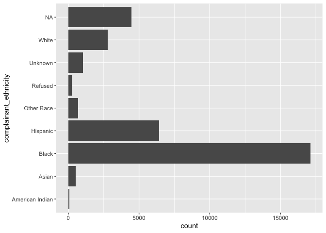
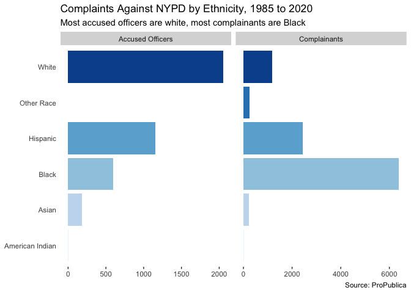

Allegations Against the NYPD
================
James P. Hare
7/28/2020

Following a change to the New York law that kept police officers’
disciplinary records secret—and amid an ongoing lawsuit—ProPublica has
released a [searchable
database](https://projects.propublica.org/nypd-ccrb/) of complaints to
to the Civilian Complaint Review Board (CCRB). The database, which can
be downloaded in its entirety
[here](https://www.propublica.org/datastore/dataset/civilian-complaints-against-new-york-city-police-officers),
includes allegations against the nearly 4,000 officers who have at least
one substantiated complaint against them. The CCRB’s powers are
extremely circumscribed, and these data reflect its
[limitations](https://www.propublica.org/article/nypd-civilian-complaint-review-board-editors-note).
The CCRB “exonerates” officers whose conduct is ruled to fall within
departmental guidelines, no matter how egregious. Allegations may remain
“unsubstantiated” due to a routine lack of NYPD cooperation (in
violation of the law), and even “substantiated” allegations lead only to
suggestions, which the department is free to ignore.

Even a quick glance through these records turns up numerous officers who
have faced repeated, serious, substantiated misconduct allegations while
rising through the ranks. But looking at these data from a bird’s eye
view also reveals some striking patterns in the complaints against NYPD
misconduct. Anyone who is familiar with New York City would not expect
police misconduct—and thus complaints about police misconduct—to be
evenly distributed geographically, and that is the case here.

<!-- -->

The most substantiated complaints by far are found in the seventy-fifth
precinct in East New York, Brooklyn, the location of a major corruption
scandal, but nearby neighborhoods in Brooklyn also see a
disproportionate number of complaints, as does the South Bronx. This map
seems to show the results of over-policing minoritized communities.

The ProPublica database records the ethnicity of both the complainant
and the accused officer.

<!-- -->

A majority of officers who have substantiated complaints against them
are white while, in cases where the ethnicity is known, a majority of
complainants are Black.
