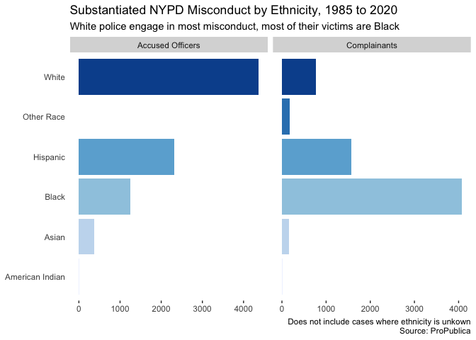
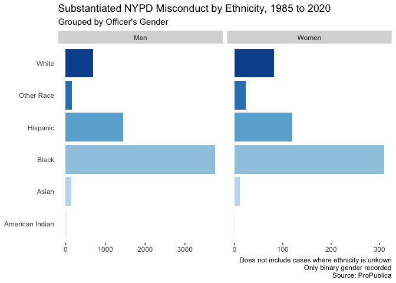

NYPD
================
James Hare
7/27/2020

<https://projects.propublica.org/nypd-ccrb/> - searchable database

<https://www.propublica.org/datastore/dataset/civilian-complaints-against-new-york-city-police-officers>
- data available for download here

<https://www.propublica.org/article/nypd-civilian-complaint-review-board-editors-note>
- explanation of data and its limitations

``` r
ggplot(allegations) +
        geom_bar(aes(x = complainant_ethnicity)) +
        coord_flip()
```

<!-- -->

``` r
ggplot(allegations) +
        geom_bar(aes(x = complainant_gender)) +
        coord_flip()
```

<!-- -->

``` r
ggplot(allegations) +
        geom_bar(aes(x = fado_type)) +
        coord_flip()
```

<!-- -->

``` r
allegations %>%
        filter(precinct < 124) %>%
ggplot() +
        geom_bar(aes(x = precinct)) 
```

<!-- -->

``` r
precinct_allegations <- allegations %>%
        filter(precinct < 124 & precinct > 0 & 
                       board_disposition != "Unsubstantiated" &
                       board_disposition!= "Exonerated") %>%
        group_by(precinct) %>%
        summarise(n = n()) %>%
        left_join(nyc_precincts)
```

    ## `summarise()` ungrouping output (override with `.groups` argument)

    ## Joining, by = "precinct"

``` r
ggplot(precinct_allegations) +
        geom_sf(aes(fill = n, geometry = geometry)) +
        labs(title = "Substantiated Complaints Against NYPD by Precinct",
             subtitle = "1985 to 2020",
             caption = "Source: ProPublica") +
        theme(legend.position = c(0, 1),
              legend.justification = c(-.4, 1.1),
              legend.title = element_blank(),
              axis.text.x = element_blank(),
              axis.ticks.x = element_blank(),
              axis.text.y = element_blank(),
              axis.ticks.y = element_blank(),
              panel.grid.major = element_blank(), 
              panel.grid.minor = element_blank(),
              panel.background = element_blank()) +
        scale_fill_continuous(type = "viridis")
```

<!-- -->
